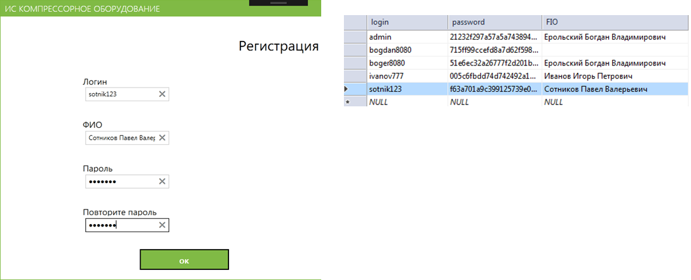
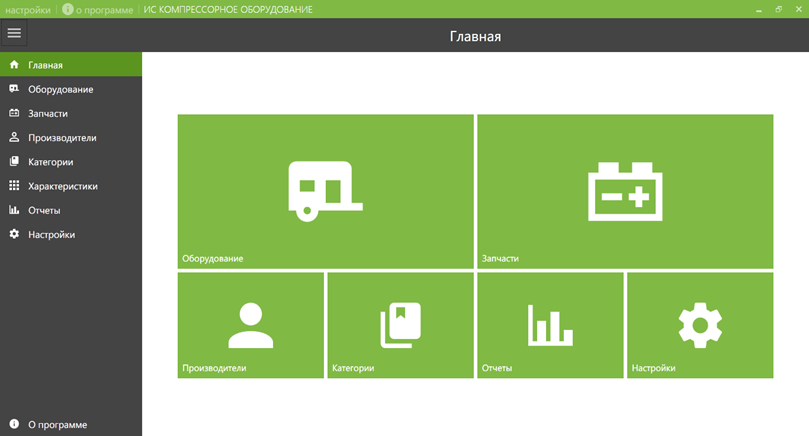
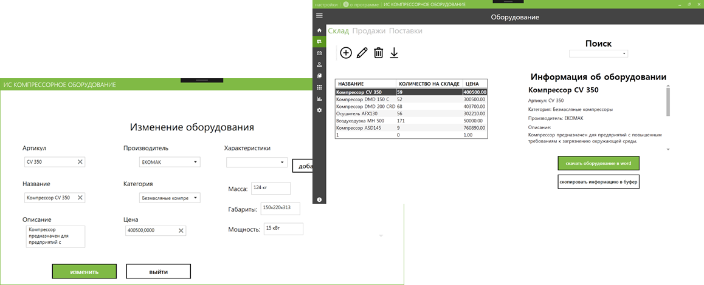
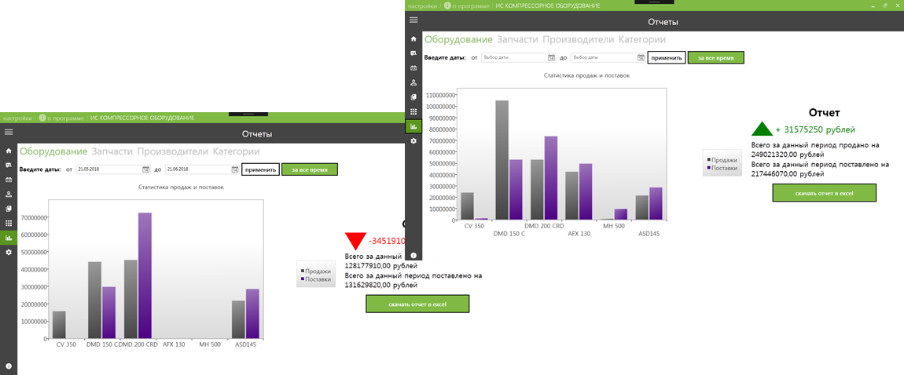
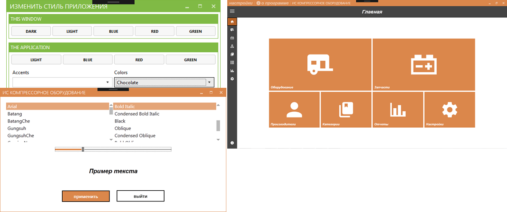
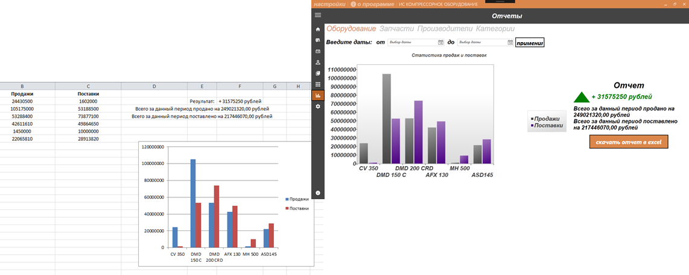

# IS-Kompressors
This project was written during the pre-graduate practice. 
The purpose of the thesis is to develop an automated information system of the store about the sale of compressor equipment for small businesses, which provides structured storage of information about equipment, spare parts, their sales and deliveries, manufacturers, as well as reporting on sales and deliveries.
# Screenshots
## Program execution

## Registration

## Main page

## Changing products

## Reports in the form of charts

## Editing styles

## Export reports to excel

